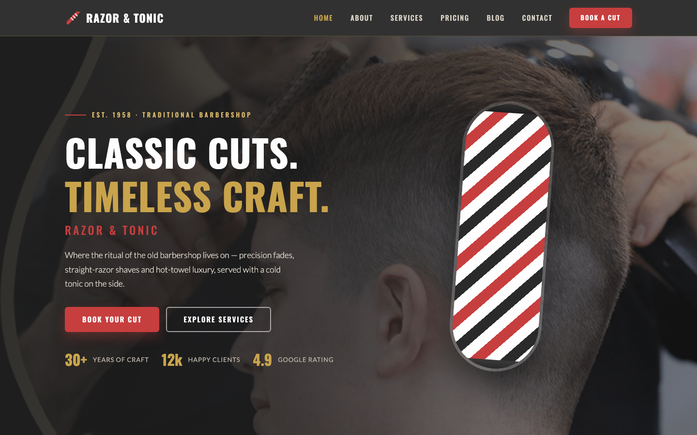

# 💈 Razor & Tonic — Classic Barbershop HTML Template

A premium, framework-free HTML template for a traditional men's barbershop. Built with pure HTML5, CSS3 and vanilla JavaScript — no build tools, no dependencies, just open `index.html` and it runs.

Razor & Tonic is designed around the craft of classic barbering: a full-width hero with a hand-coded CSS barber pole, a precision service menu, a transparent price table, an elegant portfolio gallery, testimonials with a warm towel finish, and a booking form that works out of the box.

## 📸 Screenshot

## 🎨 Design System

| Token | Value | Usage |
| --- | --- | --- |
| `--red` | `#C73E3E` | Primary accents, CTAs, price marks |
| `--charcoal` | `#2A2A2A` | Text, dark surfaces, nav |
| `--cream` | `#F5F0E8` | Page background, warm base |
| `--gold` | `#C9A44C` | Highlights, stars, details |
| `--steel` | `#5A5A5A` | Secondary text, muted copy |
| `--white` | `#FEFEFE` | Card surfaces, contrast |

- **Headings:** Oswald (500 / 600 / 700), uppercase
- **Body:** Lato (300 / 400 / 700)
- **Layout:** 1220px container, `clamp()` fluid type, CSS Grid + Flexbox
- **Breakpoints:** 980px and 720px
- **Motion:** IntersectionObserver reveals (`.reveal` → `.visible`), disabled under `prefers-reduced-motion`

## 📄 Pages

| Page | Description |
| --- | --- |
| [index.html](index.html) | Hero with CSS barber pole, services, portfolio, testimonials, team |
| [about.html](about.html) | The shop's story, stats band, values, barber team |
| [services.html](services.html) | Detailed service breakdowns + price list grid |
| [pricing.html](pricing.html) | Complete price table with time estimates |
| [blog.html](blog.html) | Journal grid with six grooming articles |
| [contact.html](contact.html) | Booking form, opening hours, embedded map |
| [404.html](404.html) | On-brand error page |

## 🧰 Tech Stack

- Semantic HTML5
- Modern CSS3 (custom properties, grid, clamp, aspect-ratio)
- Vanilla JavaScript (`assets/js/main.js`) — nav, reveals, form validation, back-to-top
- Google Fonts (Oswald + Lato)
- No frameworks, no external JS, no libraries

## 🖼️ Images

All imagery lives in `assets/img/` and ships with the template — hero, services, pricing, portfolio, testimonials, team, blog and about sections. Every image is locally bundled; nothing is pulled from external services.

---
**Template by uiuxlabz** — framework-free, responsive, production-ready.

---
### Let's Build Something Together 🚀

Have a project in mind? Let's talk — [https://tally.so/r/q4q1L9](https://tally.so/r/q4q1L9)
